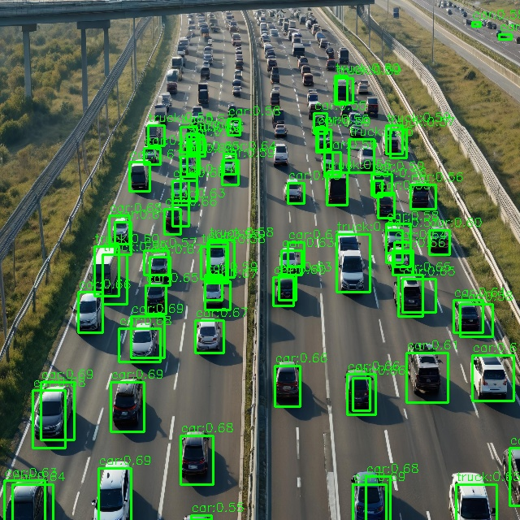
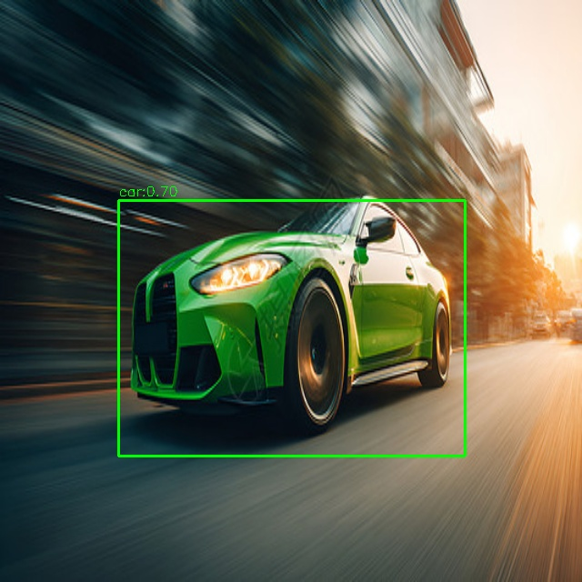
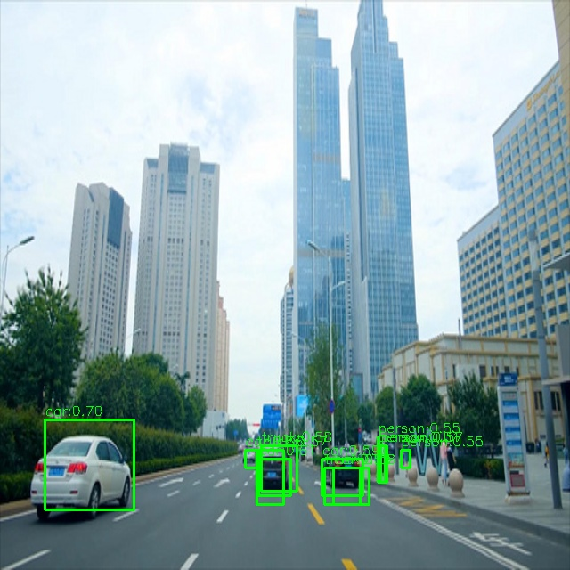
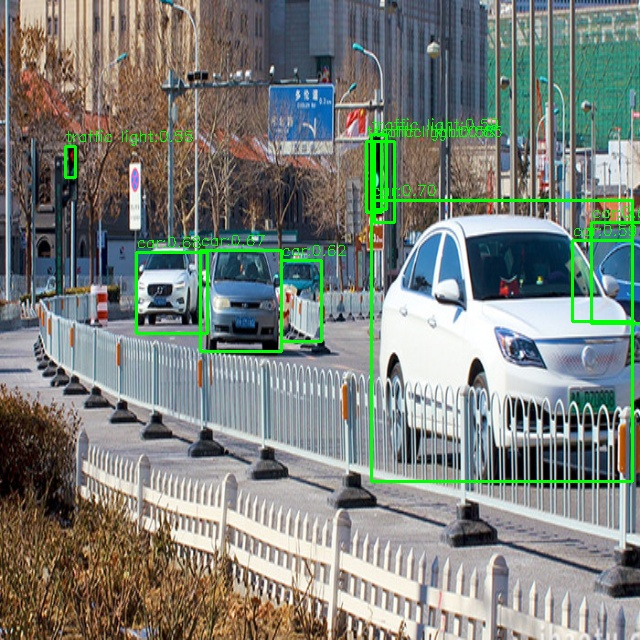
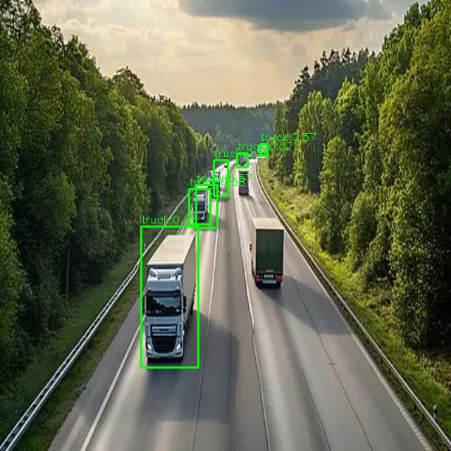

# YOLOv5 地平线征程5（J5）端侧部署

> 在地平线BPU芯片上完成 YOLOv5su 模型的 INT8 量化部署，
> 实现 C++ 推理 + SocketCAN 车载总线输出的完整闭环。
> 附带 ONNX Runtime / NCNN / MNN / LibTorch 四推理引擎横向对比。

---

## 项目亮点

-  一、全流程落地：PyTorch → ONNX → INT8 量化 → BPU 编译 → C++ 推理 → CAN 输出
-  二、量化精度对齐：余弦相似度 **0.999**（地平线工具链输出）
-  三、车规级输出：自定义 SocketCAN 双帧协议，candump 逐字节验证
-  四、性能评测：30 张图批量测试，**424 个目标零空检测**
-  五、多框架对比：ONNX Runtime / NCNN / MNN / LibTorch 四引擎 × CPU/Vulkan/OpenCL 多后端横向评测
-  六、踩坑记录：18 个实际问题的定位与解决过程

---

## 系统架构

```
┌─────────────┐     ┌──────────────┐     ┌──────────────┐     ┌─────────────┐
│  输入图像    │────▶│  地平线 BPU   │────▶│  C++ 后处理   │────▶│  SocketCAN  │
│  640×640    │     │  INT8 推理    │     │  sigmoid+NMS │     │  车载总线输出 │
│  uint8 NCHW │     │  ~6.3s/帧(仿真)│     │  置信度筛选   │     │  0x100/0x101/0x102│
└─────────────┘     └──────────────┘     └──────────────┘     └─────────────┘
```

---

## 技术栈

`C++` `Python` `PyTorch` `ONNX` `地平线 BPU SDK` `INT8 量化（PTQ）`
`SocketCAN` `CMake` `Docker` `Linux` `OpenCV` `ROS`

---

## 快速开始

### 环境要求

- Docker（地平线官方工具链镜像 `openexplorer/ai_toolchain_ubuntu_20_j5_cpu:v1.1.77-py38`）
- 地平线征程5 开发板，或使用 x86 仿真模式
- 测试图片（640×640，或程序内自动 resize）

### 1. 启动容器

```bash
# 特权模式（CAN需要），挂载工作目录
docker run -it --name horizon_j5 --privileged \
  -v ~/workspace:/workspace \
  openexplorer/ai_toolchain_ubuntu_20_j5_cpu:v1.1.77-py38 /bin/bash
```

### 2. 模型导出与量化编译

```bash
# 导出 ONNX（注意：工具链最高支持 opset=11）
python model/export_onnx.py --weights yolov5su.pt --opset 11

# 地平线工具链量化编译（生成 .bin 模型）
hb_mapper makertbin --config yolov5su.yaml --model-type onnx
```

### 3. 编译推理程序

```bash
cd infer
mkdir build && cd build
cmake ..
make -j4
```

### 4. 设置虚拟 CAN 并运行

```bash
# 安装工具（容器内首次）
apt update && apt install -y iproute2 can-utils

# 创建并启动 vcan0
ip link add dev vcan0 type vcan
ip link set up vcan0

# 后台监听 CAN
candump vcan0 > can_dump.txt &

# 运行推理
./infer_demo
```

---

## 关键技术细节

### 1. 输入类型问题定位

最初按 float32 填充输入数据，推理输出全 0。通过打印张量属性发现：

```
输入tensorType: 4    → HB_DNN_TENSOR_TYPE_U8（uint8）
输入quantiType: 0    → NONE（无量化，BPU内部归一化）
输入stride: [1228800, 409600, 640, 1]  → NCHW 布局
```

实际输入为 uint8（0-255），BPU 内部自动完成归一化。修改输入填充方式后推理正常。

### 2. 输出布局确认

输出为 NCHW 布局，`output[c * 8400 + i]`：
- 84 个通道：前 4 个为坐标（cx, cy, w, h），后 80 个为类别置信度
- 8400 个锚点
- 类别置信度需 sigmoid 后筛选（阈值 0.55）

### 3. 推理控制参数初始化

地平线 SDK 使用宏而非函数初始化控制参数：

```cpp
// 错误写法（编译报错）
hbDNNInferCtrlParam_Init(&infer_param);

// 正确写法
HB_DNN_INITIALIZE_INFER_CTRL_PARAM(&infer_param);
```

### 4. CAN 协议设计

| CAN ID | 帧类型 | 字节布局 |
|--------|--------|---------|
| `0x100` | 目标信息帧1 | `[idx, class_id, conf%, x1_low, x1_high, y1_low, y1_high, 0x01]` |
| `0x101` | 目标信息帧2 | `[idx, x2_low, x2_high, y2_low, y2_high, 0x00, 0x00, 0x02]` |
| `0x102` | 结束帧 | `[total_count, 0xFF, 0xFF, 0xFF, 0xFF, 0xFF, 0xFF, 0xFF]` |

坐标使用 uint16 小端编码，置信度 = `conf * 100`（uint8）。

candump 验证示例：
```
vcan0  100   [8]  00 02 47 F0 00 23 01 01   → 目标0: car, conf=71%, x1=240, y1=291
vcan0  101   [8]  00 B9 01 FF 01 00 00 02   → 目标0: x2=441, y2=511
vcan0  102   [8]  02 FF FF FF FF FF FF FF   → 共2个目标，结束
```

---

## 性能数据

| 指标 | 数值 | 说明 |
|------|------|------|
| 量化精度（余弦相似度） | 0.999 | 地平线工具链输出 |
| 单帧推理延迟（x86仿真） | ~6.3s | 仿真模式，开发板上会快很多 |
| 批量测试 | 30张 / 424目标 | 零空检测 |
| 平均每图目标数 | 14.1个 | 含car/truck/person/bus等 |
| 模型大小 | 12.5MB | INT8 量化后 |
| 输入内存 | 1,228,800 字节 | uint8 × 3 × 640 × 640 |
| 输出内存 | 2,822,400 字节 | float32 × 84 × 8400 |

### 类别分布（30张批量测试）

| 类别 | 数量 | 占比 |
|------|------|------|
| car | 315 | 74.3% |
| truck | 85 | 20.0% |
| bus | 10 | 2.4% |
| person | 5 | 1.2% |
| traffic light | 4 | 0.9% |
| cell phone | 4 | 0.9% |
| train | 1 | 0.2% |

---


---

## 检测效果展示

从 30 张批量测试中挑选的 5 张代表性结果，覆盖不同场景：

| 场景 | 目标数 | 说明 |
|------|--------|------|
| 密集车流 | 81 | 高速公路航拍，多车道密集车辆 |
| 简单场景 | 1 | 单目标，低复杂度 |
| 典型混合 | 12 | 多车 + 行人混合场景 |
| 多类别 | 10 | 含交通灯检测 |
| 卡车场景 | 6 | 卡车为主 |

  

 

> 完整 30 张测试结果见 [results/samples/](results/samples/)。

## 多推理引擎横向对比

详见 [docs/framework_comparison.md](docs/framework_comparison.md)。

核心结论：
- **MNN** 最快：28.7ms / 34.8 FPS（CPU）
- **ONNX Runtime** 内存最低：109MB
- **NCNN Vulkan**（AMD GPU）：77.6 FPS，较 CPU 提升 6.4 倍
- 多线程加速比 2.2~2.6 倍，NMS 串行部分（~25%）为主要瓶颈（Amdahl 定律）

---

## 项目结构

```
yolov5-j5-deployment/
├── README.md                    # 本文件
├── .gitignore
├── docker/
│   └── run_container.sh         # 容器启动脚本
├── model/
│   ├── export_onnx.py           # PyTorch 导出 ONNX
│   └── README.md                # 模型量化编译说明
├── infer/
│   ├── CMakeLists.txt
│   ├── infer_demo.cpp           # 单图推理 + CAN 输出
│   └── batch_test.cpp           # 批量测试
├── can/
│   ├── can_protocol.md          # CAN 协议详细定义
│   └── candump_verify.txt       # candump 验证结果
├── docs/
│   ├── workflow.md              # 完整部署流程
│   ├── pitfalls.md              # 踩坑记录（18个）
│   └── framework_comparison.md  # 多推理引擎对比报告
└── results/
    ├── result.jpg               # 检测结果可视化
    └── batch_test_report.txt    # 批量测试报告
```

---

## 踩坑记录

详见 [docs/pitfalls.md](docs/pitfalls.md)，记录了从环境搭建到部署验证过程中遇到的 18 个实际问题，包括：

- 容器特权模式与 CAN 设备访问
- 地平线 SDK 宏初始化 vs 函数初始化
- 输入张量类型不匹配（uint8 vs float32）
- 工具链 opset 版本限制
- OpenCV 跨容器丢失问题
- NMS 阈值调优
- ……

---

## 相关文档

- [完整部署流程](docs/workflow.md)
- [踩坑记录](docs/pitfalls.md)
- [多推理引擎对比报告](docs/framework_comparison.md)
- [CAN 协议定义](can/can_protocol.md)

---

## License

MIT
